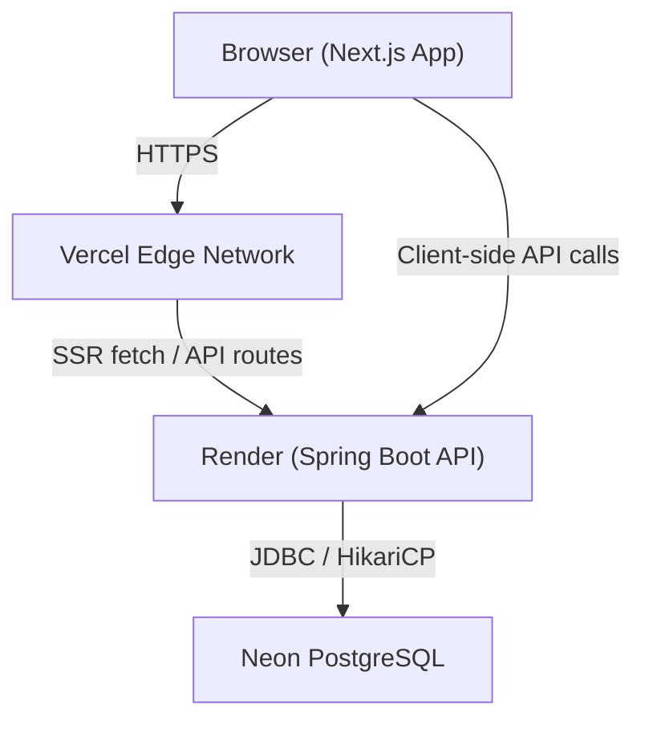

# Technical Design Document — ScentedMemories

## Overview

This document describes the technical design for a full-stack e-commerce application for ScentedMemories — a small home fragrance and wellness business. The system allows customers to browse, filter, and purchase products, and provides an admin panel for catalog and order management.

**Tech Stack:**
- Frontend: Next.js 14 (App Router), Tailwind CSS, Zustand
- Backend: Spring Boot 3.2 (Java 21), deployed via Docker on Render
- Database: PostgreSQL on Neon (serverless, pooled via PgBouncer)
- Hosting: Vercel (frontend), Render (backend, Docker free tier)

The MVP excludes payment processing. Orders are placed and recorded without payment. The cart is entirely client-side (Zustand, no server persistence).

---

## Architecture

### High-Level System Diagram



### Request Flow

**SSR Pages (product listing, product detail):**
1. Browser requests page from Vercel edge.
2. Next.js server component fetches data from Spring Boot API during render.
3. Fully rendered HTML is returned to the browser.
4. Client-side hydration enables interactivity (cart, filters).

**Client-Side Interactions (cart, checkout, auth):**
1. Browser makes direct HTTPS calls to the Spring Boot API on Render.
2. JWT is attached in the `Authorization: Bearer` header for protected routes.
3. Zustand manages cart state in-memory; no server cart persistence.

### Cold Start Mitigation

The Render free tier spins down after 15 minutes of inactivity. The frontend displays a loading skeleton/spinner on API calls and does not surface raw errors to the user during cold start delays (up to 30 seconds).

---

## Components and Interfaces

### Frontend Components

```mermaid
graph TD
    Layout["RootLayout (logo, nav, cart icon, footer)"]
    HomePage["HomePage (featured products, category links) — SSR, force-dynamic"]
    ProductListPage["ProductListPage (SSR, force-dynamic, filter sidebar, product grid)"]
    ProductDetailPage["ProductDetailPage (SSR, force-dynamic, variant selector, add-to-cart)"]
    CartPage["CartPage (line items, subtotal, checkout CTA)"]
    CheckoutPage["CheckoutPage (shipping form, order summary)"]
    OrderConfirmPage["OrderConfirmationPage (order ID, items) — client component"]
    AuthPages["AuthPages (LoginPage, RegisterPage)"]
    AdminLayout["AdminLayout (sidebar nav, auth guard, mobile hamburger)"]
    AdminDashboard["AdminDashboard (stats, recent orders, refresh)"]
    AdminProductList["AdminProductListPage (name-only search)"]
    AdminProductForm["ProductForm component (add/edit, image preview, variants, tags)"]
    AdminOrderList["AdminOrderListPage (status filter, expandable rows, inline transitions)"]

    Layout --> HomePage
    Layout --> ProductListPage
    Layout --> ProductDetailPage
    Layout --> CartPage
    Layout --> CheckoutPage
    Layout --> OrderConfirmPage
    Layout --> AuthPages
    AdminLayout --> AdminDashboard
    AdminLayout --> AdminProductList
    AdminLayout --> AdminProductForm
    AdminLayout --> AdminOrderList
```



**Key component responsibilities:**

- `ProductListPage`: SSR page (`force-dynamic`) that fetches products with active filters. Filter state lives in URL search params. On mobile, the filter sidebar collapses into a toggle button with an active filter count badge.
- `ProductDetailPage`: SSR page (`force-dynamic`). Variant selection is client-side state. "Add to Cart" dispatches to Zustand store.
- `CartPage`: Client component. Reads from Zustand cart store. Renders line items, subtotal, and link to checkout.
- `CheckoutPage`: Client component. On submit, calls `POST /api/orders`. On success, redirects to confirmation.
- `OrderConfirmationPage`: Client component (fetches on mount using JWT from localStorage — cannot be SSR because JWT is not available server-side).
- `AdminLayout`: Wraps all `/admin/*` routes. Uses a `hydrated` flag to wait for `initFromStorage()` before making auth redirect decisions — prevents race condition where Zustand hasn't read localStorage yet.
- `AdminDashboard`: Shows recent orders across all statuses (not just pending). Has a Refresh button and "Last updated" timestamp.
- `ProductForm`: Shared component for both create and edit. Supports image URL entry with live preview, variant rows (label/price/stock), and tag selection by dimension.

### Zustand Cart Store

```typescript
interface CartItem {
  variantId: number;
  productId: number;
  productName: string;
  variantLabel: string;
  price: number;        // unit price at time of add
  quantity: number;
  imageUrl: string;
}

interface CartStore {
  items: CartItem[];
  addItem: (item: Omit<CartItem, 'quantity'>) => void;
  removeItem: (variantId: number) => void;
  updateQuantity: (variantId: number, quantity: number) => void;
  clearCart: () => void;
  subtotal: () => number;
}
```

`addItem` increments quantity if `variantId` already exists. `updateQuantity(id, 0)` removes the item. `subtotal()` is a derived selector: `sum(item.price * item.quantity)`.

### Backend Layers

```
Controller (REST) → Service (business logic) → Repository (Spring Data JPA) → PostgreSQL
```

- **Controllers**: Thin — validate request body with Bean Validation, delegate to service, return ResponseEntity.
- **Services**: Contain all business logic (stock checks, soft-delete, JWT issuance, bcrypt).
- **Repositories**: Spring Data JPA interfaces with custom JPQL/native queries for filtering.
- **Security**: Spring Security filter chain — JWT filter validates token on every request before reaching controllers.

### API Client (Frontend)

A thin `apiClient` module wraps `fetch` with:
- Base URL from `NEXT_PUBLIC_API_URL` env var. Throws at build time if missing in production.
- Automatic `Authorization: Bearer <token>` header injection from localStorage.
- `cache: 'no-store'` on all fetch calls — prevents Next.js from caching API responses and serving stale data.
- Retry logic with exponential backoff for 503 responses and network errors (cold start).
- `safeJson()` helper — checks `Content-Type` before parsing error bodies, preventing secondary parse errors when Render returns HTML error pages during cold start.
- Standardized error shape: `{ status, message, errors?: Record<string, string> }`.

### Admin API

The admin uses a separate `adminProductsApi` that calls `/api/admin/products` instead of the public `/api/products`. Key difference: the admin endpoint uses `nameOnly=true` in the product filter, so searching "lavender" matches only products whose **name** contains "lavender" — not products whose description mentions it.

## Data Models

### PostgreSQL Schema

```sql
-- Categories
CREATE TABLE categories (
    id          BIGSERIAL PRIMARY KEY,
    name        VARCHAR(100) NOT NULL,
    slug        VARCHAR(100) NOT NULL UNIQUE,  -- enforced unique; used in /categories/{slug} routes
    description TEXT
);

-- Tags
CREATE TABLE tags (
    id        BIGSERIAL PRIMARY KEY,
    name      VARCHAR(100) NOT NULL,
    dimension VARCHAR(20)  NOT NULL CHECK (dimension IN ('SCENT', 'MOOD', 'USE_CASE')),
    UNIQUE (name, dimension)   -- prevents duplicate tags within the same dimension
);

-- Products
CREATE TABLE products (
    id          BIGSERIAL PRIMARY KEY,
    name        VARCHAR(255) NOT NULL,
    description TEXT,
    slug        VARCHAR(255) NOT NULL UNIQUE,  -- SEO-friendly URL segment, e.g. "lavender-aroma-oil"; UNIQUE constraint automatically creates a B-tree index; no separate index needed
    category_id BIGINT       NOT NULL REFERENCES categories(id),
    active      BOOLEAN      NOT NULL DEFAULT TRUE,
    created_at  TIMESTAMPTZ  NOT NULL DEFAULT NOW(),
    updated_at  TIMESTAMPTZ  NOT NULL DEFAULT NOW()
);

-- Product images (ordered list)
CREATE TABLE product_images (
    id         BIGSERIAL PRIMARY KEY,
    product_id BIGINT       NOT NULL REFERENCES products(id) ON DELETE CASCADE,
    url        TEXT         NOT NULL,
    position   INT          NOT NULL,  -- position must be supplied explicitly by the caller; no default to avoid silent collisions
    UNIQUE (product_id, position)  -- prevents two images at the same position for the same product; position must be explicitly set
);

-- Product variants
-- Note: `active` on a variant is independent of `active` on the parent product.
-- A variant can be deactivated (active=false) to hide it from the product detail page
-- without deactivating the entire product or its other variants.
CREATE TABLE product_variants (
    id            BIGSERIAL PRIMARY KEY,
    product_id    BIGINT         NOT NULL REFERENCES products(id) ON DELETE CASCADE,
    label         VARCHAR(100)   NOT NULL,
    price         NUMERIC(10, 2) NOT NULL CHECK (price >= 0),
    stock         INT            NOT NULL DEFAULT 0 CHECK (stock >= 0),
    active        BOOLEAN        NOT NULL DEFAULT TRUE,
    UNIQUE (product_id, label)  -- prevents two variants with the same label on the same product
);

-- Product ↔ Tag association
CREATE TABLE product_tags (
    product_id BIGINT NOT NULL REFERENCES products(id) ON DELETE CASCADE,
    tag_id     BIGINT NOT NULL REFERENCES tags(id)     ON DELETE CASCADE,
    PRIMARY KEY (product_id, tag_id)
);

-- Users
CREATE TABLE users (
    id            BIGSERIAL PRIMARY KEY,
    full_name     VARCHAR(255) NOT NULL,
    -- Email uniqueness is enforced at the DB level; basic format validation is enforced at the application layer.
    email         VARCHAR(255) NOT NULL UNIQUE,
    password_hash VARCHAR(255) NOT NULL,
    role          VARCHAR(20)  NOT NULL DEFAULT 'CUSTOMER' CHECK (role IN ('CUSTOMER', 'ADMIN')),
    created_at    TIMESTAMPTZ  NOT NULL DEFAULT NOW()
);

-- Orders
CREATE TABLE orders (
    id               BIGSERIAL PRIMARY KEY,
    user_id          BIGINT         REFERENCES users(id),   -- nullable for guest
    customer_name    VARCHAR(255)   NOT NULL,
    customer_email   VARCHAR(255)   NOT NULL,
    customer_phone   VARCHAR(50),
    shipping_street  TEXT           NOT NULL,
    shipping_city    VARCHAR(100)   NOT NULL,
    shipping_state   VARCHAR(100)   NOT NULL,
    shipping_postal  VARCHAR(20)    NOT NULL,
    shipping_country VARCHAR(100)   NOT NULL DEFAULT 'India',
    status           VARCHAR(20)    NOT NULL DEFAULT 'PENDING'
                         CHECK (status IN ('PENDING','PROCESSING','SHIPPED','FULFILLED','CANCELLED')),
    total_amount     NUMERIC(10, 2) NOT NULL CHECK (total_amount > 0),  -- an order must have a positive total
    created_at       TIMESTAMPTZ    NOT NULL DEFAULT NOW(),
    updated_at       TIMESTAMPTZ    NOT NULL DEFAULT NOW()
);

-- Order items
CREATE TABLE order_items (
    id                   BIGSERIAL PRIMARY KEY,
    order_id             BIGINT         NOT NULL REFERENCES orders(id) ON DELETE CASCADE,
    variant_id           BIGINT         NOT NULL REFERENCES product_variants(id),
    variant_label_snap   VARCHAR(100)   NOT NULL,  -- snapshot of variant label at order time
    product_name_snap    VARCHAR(255)   NOT NULL,  -- snapshot of product name at order time; preserved if product is later renamed
    unit_price_snap      NUMERIC(10, 2) NOT NULL,  -- snapshot of price at order time
    quantity             INT            NOT NULL CHECK (quantity > 0),
    UNIQUE (order_id, variant_id)  -- prevents duplicate line items for the same variant in one order
);

-- Indexes for common query patterns
CREATE INDEX idx_products_category    ON products(category_id) WHERE active = TRUE;
CREATE INDEX idx_variants_product     ON product_variants(product_id);
CREATE INDEX idx_product_tags_tag     ON product_tags(tag_id);
CREATE INDEX idx_orders_user          ON orders(user_id);
-- idx_orders_status omitted: low cardinality at MVP scale; add post-MVP if admin status filtering degrades
CREATE INDEX idx_orders_created       ON orders(created_at DESC);
```

### JPA Entity Summary

| Entity | Table | Key Relationships | Notable Columns |
|---|---|---|---|
| `Category` | `categories` | OneToMany → `Product` | `slug` (UNIQUE) |
| `Tag` | `tags` | ManyToMany ← `Product` via `product_tags` | UNIQUE on `(name, dimension)` |
| `Product` | `products` | ManyToOne → `Category`; OneToMany → `ProductVariant`, `ProductImage`; ManyToMany → `Tag` | `slug` (UNIQUE, indexed); `active` |
| `ProductVariant` | `product_variants` | ManyToOne → `Product` | UNIQUE on `(product_id, label)`; `active` is independent of parent product's `active` |
| `ProductImage` | `product_images` | ManyToOne → `Product` | UNIQUE on `(product_id, position)` |
| `User` | `users` | OneToMany → `Order` | `email` (UNIQUE); format validated at app layer |
| `Order` | `orders` | ManyToOne → `User` (nullable); OneToMany → `OrderItem` | `total_amount > 0` (CHECK) |
| `OrderItem` | `order_items` | ManyToOne → `Order`; ManyToOne → `ProductVariant` | `product_name_snap`; `variant_label_snap`; UNIQUE on `(order_id, variant_id)` |

---

## API Design

### Base URL

- Development: `http://localhost:8080`
- Production: `https://<render-service>.onrender.com`

### Authentication

All protected endpoints require `Authorization: Bearer <jwt>`. The JWT payload contains:
```json
{ "sub": "<userId>", "role": "CUSTOMER|ADMIN", "exp": <unix_ts> }
```

JWT secret is injected via `JWT_SECRET` environment variable. Token expiry: 7 days.

### Response Envelope

Success responses return the resource directly (no wrapper). Error responses use:
```json
{
  "status": 400,
  "message": "Validation failed",
  "errors": { "email": "must not be blank" }
}
```

### Endpoint Reference

#### Auth

| Method | Path | Auth | Description |
|---|---|---|---|
| POST | `/api/auth/register` | Public | Register customer |
| POST | `/api/auth/login` | Public | Login, returns JWT |

**POST /api/auth/register** request:
```json
{ "fullName": "Jane Doe", "email": "jane@example.com", "password": "secret123" }
```
Response `201`: `{ "id": 1, "fullName": "Jane Doe", "email": "...", "role": "CUSTOMER", "token": "<jwt>" }`

**POST /api/auth/login** request:
```json
{ "email": "jane@example.com", "password": "secret123" }
```
Response `200`: `{ "token": "<jwt>", "role": "CUSTOMER", "userId": 1 }`

#### Products (Public)

| Method | Path | Auth | Description |
|---|---|---|---|
| GET | `/api/products` | Public | Paginated, filtered product list |
| GET | `/api/products/{slug}` | Public | Single product with variants and tags, looked up by slug |
| GET | `/api/categories` | Public | All categories |
| GET | `/api/tags` | Public | All tags grouped by dimension |

**GET /api/products** query params:
- `page` (default 0), `size` (default 20)
- `categoryId` (Long)
- `tagIds` (Long[], multi-value: `?tagIds=1&tagIds=3`)
- `minPrice`, `maxPrice` (BigDecimal)
- `search` (String, case-insensitive LIKE on name + description)

Response `200`:
```json
{
  "content": [
    {
      "id": 1,
      "slug": "lavender-aroma-oil",
      "name": "Lavender Aroma Oil",
      "primaryImageUrl": "https://...",
      "startingPrice": 199.00,
      "category": { "id": 1, "name": "Oils", "slug": "oils" },
      "tags": [{ "id": 2, "name": "Lavender", "dimension": "SCENT" }]
    }
  ],
  "totalElements": 42,
  "totalPages": 3,
  "page": 0,
  "size": 20
}
```

**GET /api/products/{slug}** response `200`:
```json
{
  "id": 1,
  "name": "Lavender Aroma Oil",
  "description": "...",
  "images": ["https://...", "https://..."],
  "category": { "id": 1, "name": "Oils", "slug": "oils" },
  "tags": [{ "id": 2, "name": "Lavender", "dimension": "SCENT" }],
  "variants": [
    { "id": 10, "label": "10ml", "price": 199.00, "stock": 25, "active": true },
    { "id": 11, "label": "30ml", "price": 499.00, "stock": 0,  "active": true }
  ],
  "active": true
}
```

#### Admin — Products

| Method | Path | Auth | Description |
|---|---|---|---|
| GET | `/api/admin/products` | ADMIN | List all products — name-only search |
| GET | `/api/admin/products/{id}` | ADMIN | Get full product detail for edit form |
| POST | `/api/admin/products` | ADMIN | Create product |
| PUT | `/api/admin/products/{id}` | ADMIN | Update product |
| DELETE | `/api/admin/products/{id}` | ADMIN | Soft-delete product |
| PUT | `/api/admin/products/{productId}/variants/{variantId}/inventory` | ADMIN | Update stock |

**GET /api/admin/products** query params:
- `search` — matches product **name only** (not description). Prevents "lavender" from matching Eucalyptus because its description mentions lavender.
- `page`, `size`

**POST /api/admin/products** request:
```json
{
  "name": "Rose Water",
  "description": "Pure distilled rose water...",
  "categoryId": 5,
  "tagIds": [3, 7],
  "imageUrls": ["https://..."],
  "variants": [
    { "label": "100ml", "price": 299.00, "stock": 50 }
  ]
}
```

**PUT /api/admin/products/{productId}/variants/{variantId}/inventory** request:
```json
{ "stock": 30 }
```

#### Orders

| Method | Path | Auth | Description |
|---|---|---|---|
| POST | `/api/orders` | Public (JWT optional) | Place order |
| GET | `/api/orders/{id}` | Authenticated user (owner) or ADMIN; guest orders: ADMIN only | Get order detail |
| GET | `/api/admin/orders` | ADMIN | Paginated order list |
| PUT | `/api/admin/orders/{id}/status` | ADMIN | Update order status |

**POST /api/orders** request:

For authenticated users, ownership is verified by matching `orders.user_id` to the `sub` claim in the JWT. For guest orders (`user_id = NULL`), the endpoint is accessible to ADMIN role only — guest customers have no mechanism to prove ownership post-checkout. Guest customers see their order summary on the order confirmation page only; no order lookup endpoint is available to unauthenticated users.
```json
{
  "customerName": "Jane Doe",
  "customerEmail": "jane@example.com",
  "customerPhone": "+91-9876543210",
  "shippingAddress": {
    "street": "12 MG Road",
    "city": "Bangalore",
    "state": "Karnataka",
    "postalCode": "560001",
    "country": "India"
  },
  "items": [
    { "variantId": 10, "quantity": 2 }
  ]
}
```

Response `201`: Full order object with generated `id`, `status: "PENDING"`, `totalAmount`, and `items` with snapshots.

**PUT /api/admin/orders/{id}/status** request:
```json
{ "status": "SHIPPED" }
```

---

## Key Technical Decisions

### 1. Cart is Client-Side Only

The cart lives entirely in Zustand (in-memory, no localStorage persistence by default for MVP). This avoids a server-side cart API, session management, and cart-merge complexity for guest vs. authenticated users. Trade-off: cart is lost on page refresh. This is acceptable for MVP given the low-friction checkout goal.

### 2. Filter State in URL Search Params

Product list filters are stored in URL search params (`?categoryId=1&tagIds=2&minPrice=100`) rather than component state. This enables SSR to read filters on the server, makes filter state shareable via URL, and supports browser back/forward navigation correctly.

### 3. Soft Delete for Products

Products are never hard-deleted. `active = false` hides them from the public catalog while preserving `order_items` references. This satisfies the order history integrity requirement without complex foreign key workarounds.

### 4. Denormalized Snapshots in OrderItems

`variant_label_snap`, `product_name_snap`, and `unit_price_snap` are copied at order creation time. This ensures order history is accurate even if the admin later changes a variant's label, renames the product, or updates a variant's price.

### 5. Connection Pool Sizing for Neon Free Tier

HikariCP is configured with `maximum-pool-size=5` (well within Neon free tier's ~10 connection limit). This is set via `spring.datasource.hikari.maximum-pool-size=5` in `application.properties`.

### 6. JWT Storage on Frontend

JWT is stored in `localStorage` for simplicity in MVP. An `httpOnly` cookie approach is more secure but requires additional CSRF handling. This is flagged as a post-MVP security hardening item.

### 7. Product Filtering Query Strategy

The backend uses a Spring Data JPA `Specification` (Criteria API) to dynamically compose the product filter query. This avoids N+1 issues and keeps the query logic in one place. Tag filtering uses an `EXISTS` subquery against `product_tags` for each tag ID (AND logic).

The `ProductFilterParams` record includes a `nameOnly` flag:
- `nameOnly=false` (default, public API): search matches name OR description — customers can find products by scent notes mentioned in descriptions.
- `nameOnly=true` (admin API): search matches name only — admins look up products by name, not by description content.

### 8. Docker Runtime on Render

Render Blueprint does not support `runtime: java`. The backend is deployed as a Docker container using a multi-stage build:
- Stage 1 (`eclipse-temurin:21-jdk-alpine`): Maven build, produces fat JAR
- Stage 2 (`eclipse-temurin:21-jre-alpine`): Runtime image, runs as non-root `spring` user

The `ENTRYPOINT` uses shell form (not JSON array) so `$PORT` is expanded at runtime from Render's injected environment variable.

### 9. Database Credentials Split from URL

The PostgreSQL JDBC driver rejects URLs with credentials embedded in the standard `user:pass@host` format when the password contains certain characters. Credentials are passed as separate Spring properties (`DB_USERNAME`, `DB_PASSWORD`) rather than embedded in `DATABASE_URL`.

### 10. Product Images in Next.js Public Folder

Product images are stored in `frontend/public/` and served by Vercel at root paths (e.g. `/lavender-essential-oil.jpeg`). Image URLs in the database are relative paths. This avoids external CDN dependency for MVP. Adding a new product image requires: drop file in `public/`, commit and push, then set the URL in the admin panel.

### 11. N+1 Prevention for Product Listing Images

The product listing query (`findAll(spec, pageable)`) uses lazy loading. With `open-in-view=false`, the Hibernate session closes before the mapper runs, so `p.getImages()` returns empty. Fix: a single batch query (`findPrimaryImageUrlsByProductIds`) fetches all `position=0` image URLs for the current page in one SQL call, then passes them into the mapper.

### 12. Admin Auth Hydration Race Condition

The admin layout checks `user` and `isAdmin` from Zustand. On first render these are `null` because `initFromStorage()` hasn't run yet. Without a guard, the layout immediately redirects to `/admin/login`. Fix: a `hydrated` flag is set after `initFromStorage()` completes. The auth redirect effect waits for `hydrated=true` before acting.

---

## Correctness Properties

*A property is a characteristic or behavior that should hold true across all valid executions of a system — essentially, a formal statement about what the system should do. Properties serve as the bridge between human-readable specifications and machine-verifiable correctness guarantees.*

### Property 1: Product filter results satisfy all applied filters

*For any* combination of category, tag, price range, and search term filters, every product returned by the listing API must satisfy ALL applied filter conditions simultaneously (AND logic).

**Validates: Requirements 1.2, 2.3, 2.5**

### Property 2: Search is case-insensitive and matches name or description

*For any* search term, every product returned by the search API must contain that term (case-insensitively) in either its name or its description; no product lacking the term in both fields should appear in results.

**Validates: Requirements 2.3**

### Property 3: Clearing all filters returns the full active catalog

*For any* filter state, clearing all filters and re-querying should return the same set of products as a query with no filters applied.

**Validates: Requirements 2.4**

### Property 4: Product detail response includes all variants and tags

*For any* product ID that exists and is active, the product detail API response must include all associated variants (with label, price, stock) and all associated tags (with name and dimension).

**Validates: Requirements 3.1, 3.2, 3.5**

### Property 5: Out-of-stock variants are correctly identified

*For any* product variant with `stock = 0`, the product detail API must return that variant with a status indicating it is unavailable, and the frontend must disable the add-to-cart action for that variant.

**Validates: Requirements 3.3, 11.3**

### Property 6: Cart subtotal is always the sum of price × quantity

*For any* cart state containing one or more items, the computed subtotal must equal the exact arithmetic sum of `price × quantity` for every item in the cart.

**Validates: Requirements 6.6**

### Property 7: Adding an existing variant to the cart increments quantity, not count

*For any* cart state and any variant already present in the cart, calling `addItem` for that variant must result in the cart containing exactly one entry for that variant with an incremented quantity, and the total item count must increase by the added quantity only.

**Validates: Requirements 6.2**

### Property 8: Removing a cart item leaves no trace

*For any* cart state and any variant present in the cart, calling `removeItem` for that variant must result in the cart containing zero entries for that variant.

**Validates: Requirements 6.4**

### Property 9: Order creation decrements inventory by ordered quantity

*For any* valid order placement, after the order is persisted, each ordered variant's stock must be exactly `(stock_before − ordered_quantity)`.

**Validates: Requirements 7.6**

### Property 10: Orders exceeding available stock are rejected

*For any* order where the requested quantity for any variant exceeds that variant's current stock, the backend must return a 409/400 error and must not create the order or modify any inventory.

**Validates: Requirements 7.7**

### Property 11: Order creation produces a complete, consistent record

*For any* valid checkout submission, the created order must have status `PENDING`, a `totalAmount` equal to the sum of `unit_price_snap × quantity` for all order items, and each order item must carry the correct variant label and price snapshots.

**Validates: Requirements 7.3**

### Property 12: Passwords are never stored in plaintext

*For any* user registration, the value stored in `password_hash` must not equal the submitted plaintext password (it must be a valid bcrypt hash).

**Validates: Requirements 8.4, 15.2**

### Property 13: Duplicate email registration is rejected

*For any* email address already present in the users table, a registration attempt with that email must return a 409 error and must not create a new user record.

**Validates: Requirements 8.2**

### Property 14: Admin endpoints reject unauthenticated and under-privileged requests

*For any* admin API endpoint, a request without a valid JWT must receive a 401 response, and a request with a valid CUSTOMER-role JWT must receive a 403 response.

**Validates: Requirements 9.2, 9.3**

### Property 15: Soft-deleted products are excluded from the public catalog

*For any* product marked `active = false`, it must not appear in any public product listing or be retrievable via the public product detail endpoint.

**Validates: Requirements 10.6**

### Property 16: Stock cannot be set to a negative value

*For any* inventory update request with a negative stock value, the backend must return a 400 validation error and must not modify the variant's stock.

**Validates: Requirements 11.4**

### Property 17: Order status updates are persisted and reflected

*For any* valid order status update by an admin, fetching the order immediately after must return the new status value.

**Validates: Requirements 12.5**

### Property 18: Concurrent stock decrement never results in negative stock

*For any* set of concurrent order placement requests that collectively request more units of a variant than are in stock, the backend must fulfill at most as many orders as stock permits and must never decrement stock below zero. The backend MUST acquire a `SELECT FOR UPDATE` (pessimistic row-level lock) on the `product_variants` row before reading and decrementing stock, so that concurrent transactions are serialized at the database level and the stock invariant `stock >= 0` is preserved under all concurrent conditions.

**Validates: Requirements 7.6, 7.7**

### Property 19: Order total is always computed server-side from current database prices

*For any* order placement request, the `total_amount` persisted in the `orders` table and the `unit_price_snap` values in `order_items` must be derived exclusively from the current `price` values in the `product_variants` table at the moment of order creation. Any price values supplied by the client in the request body must be ignored for total calculation. The client cannot influence the stored price by sending a modified price field.

**Validates: Requirements 7.3**

### Property 20: Invalid order status transitions are rejected

*For any* order status update request, the backend must enforce the following valid transition graph and reject all other transitions with a 400 error:

- `PENDING` → `PROCESSING` ✓
- `PROCESSING` → `SHIPPED` ✓
- `SHIPPED` → `FULFILLED` ✓
- `PENDING` → `CANCELLED` ✓
- `PROCESSING` → `CANCELLED` ✓
- All other transitions (e.g., `FULFILLED` → `PENDING`, `CANCELLED` → `PROCESSING`, `SHIPPED` → `PENDING`) are invalid and must be rejected.

*For any* order in a terminal state (`FULFILLED` or `CANCELLED`), any further status update must be rejected with a 400 error.

**Validates: Requirements 12.4, 12.5**

---

## Edge Cases and Invariants

This section documents specific edge conditions that the implementation must handle correctly. Each case describes the trigger, the required behavior, and the rationale.

### EC-1: Concurrent Order Placement (Race Condition on Stock)

**Trigger:** Two or more customers simultaneously place orders for the last available unit(s) of the same variant.

**Required behavior:** The `OrderService` MUST acquire a pessimistic row-level lock (`SELECT ... FOR UPDATE`) on the `product_variants` row before reading the current stock and decrementing it. This serializes concurrent transactions at the database level. The first transaction to acquire the lock proceeds; subsequent transactions wait, then re-read the (already decremented) stock and fail with an `InsufficientStockException` if stock is now insufficient. The stock value in `product_variants.stock` must never go below zero as a result of concurrent orders.

**Implementation note:** In Spring Data JPA, use `@Lock(LockModeType.PESSIMISTIC_WRITE)` on the repository method that fetches the variant for stock decrement.

**Rationale:** Without a lock, two transactions can both read `stock = 1`, both pass the `stock >= quantity` check, and both decrement, resulting in `stock = -1` (oversell).

---

### EC-2: Variant Deactivation vs. Product Deactivation

**Trigger:** Admin sets `active = false` on a variant, or `active = false` on a product.

**Required behavior:**
- Deactivating a **variant** (`product_variants.active = false`) hides that specific variant from the product detail page. The product itself and all other variants remain visible and purchasable. The deactivated variant must not appear in the variant selector on the frontend and must be rejected if included in an order request.
- Deactivating a **product** (`products.active = false`) hides the entire product from all public endpoints (listing and detail). All variants of that product become inaccessible to customers, regardless of their individual `active` flags.
- These two flags are fully independent. A product can be active while some of its variants are inactive.

---

### EC-3: Order with Zero or Missing Items

**Trigger:** A `POST /api/orders` request is submitted with an empty `items` array or with the `items` field absent.

**Required behavior:** The backend MUST return a `400 Bad Request` error with a descriptive message (e.g., `"items must not be empty"`). No order record is created. The frontend must also validate that the cart is non-empty before enabling the "Place Order" button and before navigating to the checkout page.

---

### EC-4: Cart Price Staleness at Checkout

**Trigger:** A customer adds a variant to their cart (Zustand stores the price at add-time), and the admin subsequently changes that variant's price before the customer completes checkout.

**Required behavior:** The backend MUST ignore any price values sent by the client in the `POST /api/orders` request body. At order creation time, the backend fetches the current `price` from `product_variants` for each ordered variant and uses those values to compute `unit_price_snap` and `total_amount`. The client-supplied price is never used for any server-side calculation or persistence.

**Consequence:** The order will be placed at the current (updated) price, not the price the customer saw when they added the item to their cart. This is an accepted MVP trade-off. The frontend displays the price from the cart (which may be stale), but the order confirmation will reflect the server-computed total.

---

### EC-5: Guest Order with Email Matching a Registered User

**Trigger:** A guest customer places an order using an email address that is already registered as a user account.

**Required behavior:** The order is created with `user_id = NULL` (guest order). No automatic account linking or association occurs. The registered user's account is not modified. This is intentional: guest checkout does not require authentication, and the system does not infer ownership from email address alone.

---

### EC-6: Admin Deletes a Category That Has Associated Products

**Trigger:** Admin attempts to delete a category that has one or more products assigned to it.

**Required behavior:** The backend MUST return a `400 Bad Request` error and must not delete the category. The `products.category_id` column is `NOT NULL`, so deleting the category would either violate the foreign key constraint or orphan products. The admin must first reassign all products in that category to a different category, or soft-delete all products in that category (`active = false`), before the category can be deleted.

**Implementation note:** The service layer should check `productRepository.countByCategoryId(categoryId) > 0` before attempting deletion and throw a descriptive exception if true.

---

### EC-7: Admin Deactivates a Variant That Is in Active Customer Carts

**Trigger:** Admin sets `active = false` on a variant while one or more customers have that variant in their Zustand cart.

**Required behavior:** Because the cart is entirely client-side, there is no server-side mechanism to invalidate in-flight carts. The deactivation takes effect immediately on the server. When the affected customer subsequently attempts to place an order containing that variant, the backend's pre-order validation MUST check that each requested variant has `active = true` and `stock > 0`. If the variant is inactive, the backend returns a `400` or `409` error with a message indicating the variant is no longer available. The frontend displays this error and prompts the customer to update their cart.

---

### EC-8: Duplicate Tag Assignment to a Product

**Trigger:** The same `tag_id` is assigned to the same `product_id` more than once (e.g., via two concurrent admin requests or a bug in the admin form).

**Required behavior:** The operation must be idempotent. Because `product_tags` has a composite `PRIMARY KEY (product_id, tag_id)`, the database will reject the duplicate insert with a unique constraint violation. The service layer MUST handle this by using an `INSERT ... ON CONFLICT DO NOTHING` statement (or equivalent JPA existence check) so that assigning an already-assigned tag returns success (no error) rather than a 500. No duplicate row is created.

---

### EC-9: Empty Cart Checkout Attempt

**Trigger:** A customer navigates directly to `/checkout` with an empty cart, or the cart becomes empty between navigation and form submission.

**Required behavior:**
- **Frontend:** The checkout page MUST check the Zustand cart on mount. If the cart is empty, the page redirects the customer to the product listing page rather than rendering the checkout form.
- **Backend:** As per EC-3, the backend independently validates that `items` is non-empty and returns `400` if not.

---

### EC-10: Order Status Transition Rules

**Trigger:** Admin submits a `PUT /api/admin/orders/{id}/status` request with a new status value.

**Required behavior:** The backend MUST enforce the following directed transition graph. Any transition not listed below is invalid and MUST be rejected with a `400 Bad Request` error.

| From | To | Allowed |
|---|---|---|
| `PENDING` | `PROCESSING` | ✓ |
| `PENDING` | `CANCELLED` | ✓ |
| `PROCESSING` | `SHIPPED` | ✓ |
| `PROCESSING` | `CANCELLED` | ✓ |
| `SHIPPED` | `FULFILLED` | ✓ |
| Any | Any other transition | ✗ — return 400 |

`FULFILLED` and `CANCELLED` are terminal states. No further transitions are permitted from either state.

**Implementation note:** Encode this as a `Map<OrderStatus, Set<OrderStatus>>` of allowed transitions in the service layer. On each status update, look up the current status, check if the requested status is in the allowed set, and throw an `InvalidStatusTransitionException` (mapped to 400) if not.

---

## Error Handling

### Backend Error Strategy

All exceptions are handled by a global `@ControllerAdvice` (`GlobalExceptionHandler`) that maps exceptions to standardized error responses:

| Exception | HTTP Status | Notes |
|---|---|---|
| `EntityNotFoundException` | 404 | Product, order, or variant not found |
| `MethodArgumentNotValidException` | 400 | Bean Validation failures; field errors included |
| `InsufficientStockException` (custom) | 409 | Ordered quantity exceeds stock |
| `DuplicateEmailException` (custom) | 409 | Email already registered |
| `InvalidStatusTransitionException` (custom) | 400 | Order status transition not permitted by transition graph |
| `CategoryNotEmptyException` (custom) | 400 | Category deletion blocked because products are still assigned |
| `AccessDeniedException` | 403 | Spring Security |
| `AuthenticationException` | 401 | Spring Security |
| `Exception` (catch-all) | 500 | Generic message only; no stack trace exposed |

Internal error details (stack traces, SQL errors) are never included in API responses. The `spring.jpa.show-sql` property is disabled in production.

### Frontend Error Strategy

- API errors are caught in the `apiClient` module and normalized to `{ message, errors }`.
- Form validation errors (400 responses) are mapped to inline field errors using the `errors` map.
- Network errors and 5xx responses show a toast notification with a retry option.
- Cold start 503s trigger a loading state with a "Connecting to server..." message for up to 35 seconds before showing an error.

---

## Testing Strategy

### Unit Tests (Backend — JUnit 5 + Mockito)

Focus on service layer business logic:
- `ProductService`: filter query composition, soft-delete behavior, variant stock updates.
- `OrderService`: stock validation, inventory decrement, total calculation, snapshot capture, order status update and transition enforcement.
- `AuthService`: bcrypt hashing verification, JWT generation and validation, duplicate email check.

Avoid testing JPA repositories directly in unit tests; use integration tests for persistence.

### Integration Tests (Backend — Spring Boot Test + Testcontainers)

- Spin up a real PostgreSQL container (Testcontainers) for repository and controller tests.
- Test the full request → controller → service → repository → database round trip.
- Cover: product CRUD, order placement with stock decrement, auth flows, RBAC enforcement.
- 1–3 representative examples per scenario (not property-based for infrastructure paths).

### Property-Based Tests (Backend — jqwik)

Use [jqwik](https://jqwik.net/) (Java property-based testing library) for the properties defined above.

Each property test runs a minimum of 100 iterations. Tests are tagged with the property they validate:

```java
// Feature: scented-memories, Property 6: Cart subtotal is always sum of price × quantity
@Property(tries = 100)
void cartSubtotalEqualsSum(@ForAll List<@Positive BigDecimal> prices,
                            @ForAll @IntRange(min=1, max=10) List<Integer> quantities) { ... }
```

Properties to implement as PBT:
- Property 1: Filter results satisfy all applied filters (mock repository, generate filter combos)
- Property 6: Cart subtotal calculation (pure function, no I/O)
- Property 7: Cart deduplication on add (pure Zustand reducer logic)
- Property 8: Cart item removal (pure Zustand reducer logic)
- Property 9: Inventory decrement after order (mock repository)
- Property 10: Over-stock orders rejected (mock repository, generate quantities > stock)
- Property 11: Order record completeness (mock repository)
- Property 12: Password never stored as plaintext (generate random passwords)
- Property 13: Duplicate email rejected (mock repository)
- Property 14: Admin endpoint RBAC (mock security context, generate endpoints)
- Property 15: Soft-deleted products excluded (mock repository)
- Property 16: Negative stock rejected (generate negative integers)
- Property 17: Status update round-trip (mock repository)
- Property 18: Concurrent stock decrement never results in negative stock (Testcontainers, concurrent threads)
- Property 19: Order total computed server-side from DB prices (mock repository, generate client-supplied prices that differ from DB prices)
- Property 20: Invalid order status transitions rejected (generate invalid transition pairs, mock repository)

### Frontend Tests (Jest + React Testing Library)

- Unit test Zustand store reducers (cart add, remove, update, subtotal).
- Component tests for `ProductCard`, `VariantSelector`, `CartDrawer`, `CheckoutForm`.
- Test form validation behavior (missing fields, invalid email format).
- Mock `apiClient` for component tests.

### Property-Based Tests (Frontend — fast-check)

Use [fast-check](https://fast-check.io/) for frontend properties:
- Property 6: Subtotal calculation in Zustand store.
- Property 7: Cart deduplication.
- Property 8: Cart item removal.

### End-to-End Tests (Playwright — optional, post-MVP)

Key user journeys: browse → filter → add to cart → checkout → confirmation.
